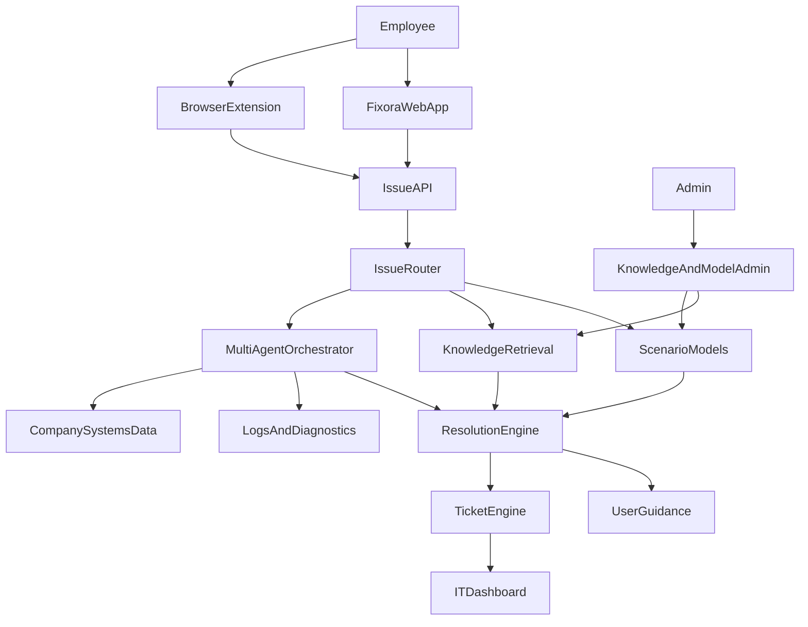

# Fixora AI Office Support Implementation Plan

## 1. Final Product Vision

Fixora should evolve into an AI-powered enterprise issue resolution platform for office employees and IT support teams.

The system should help non-technical employees report and resolve problems with company web systems, devices, access, software, network, email, and other office tools. Behind the scenes, Fixora should use scenario-specific prediction models, company knowledge, logs, ticket history, and multi-agent AI workflows to provide accurate troubleshooting guidance or escalate to IT with complete context.

The key product idea is:

> Use fast, controlled, scenario-specific models for common known issues, and use multi-agent AI only when the issue is unknown, complex, or company-specific.

This avoids depending only on a general AI model, reduces API cost, improves accuracy for repeated scenarios, and gives the system a clear path for real enterprise use.

## 2. Target Users

### 2.1 Non-IT Employees

These users need simple, guided support while working.

Examples:

- "I cannot log in to the HR system."
- "The finance portal shows an error when I submit an invoice."
- "My laptop camera is not working."
- "VPN is connected but internal apps are not opening."
- "Email is not syncing."
- "The browser page is stuck loading."

For these users, the system must avoid technical language and provide clear step-by-step actions.

### 2.2 IT Helpdesk Staff

These users need better triage and context.

They should receive:

- auto-categorized tickets
- predicted root cause
- affected system or device
- severity and priority
- suggested fix
- browser/device context
- related known issues
- related logs or database evidence if available

### 2.3 IT Administrators

These users configure company-specific knowledge and controls.

They should manage:

- supported company systems
- uploaded documents and SOPs
- datasets and model versions
- escalation rules
- teams and assignment rules
- integrations
- security policies

## 3. Product Scope

### 3.1 In Scope

- Employee web support portal
- Browser extension for web-based company systems
- IT helpdesk dashboard
- Issue classification and routing
- Scenario-specific prediction models
- Knowledge retrieval from company documents
- Multi-agent fallback for unknown or complex issues
- Ticket creation and lifecycle
- Confidence scoring and escalation
- Log and diagnostic integration with the current Fixora backend
- Admin configuration for company systems and support rules

### 3.2 Out of Scope for Early Versions

These should not be built first because they can create dead ends or make the project too large:

- full replacement for ServiceNow or Jira Service Management
- full Active Directory, Okta, or Entra ID administration
- full endpoint management like Intune or Jamf
- direct device control or remote desktop
- full SIEM replacement like Splunk or Sentinel
- autonomous changes to production systems without human approval

The first goal is to become the intelligent front door and triage layer between employees and IT, not to replace every enterprise IT platform.

## 4. Core Architecture



### 4.1 Existing Fixora Components to Reuse

The current codebase already has useful foundations:

- FastAPI backend in `backend/app/main.py`
- agent orchestration in `backend/app/agents/`
- log parsing and anomaly services in `backend/app/services/`
- RBAC users and roles in `backend/app/models/entities.py`
- React pages in `frontend/src/pages/`
- authentication context in `frontend/src/context/AuthContext.tsx`
- current database schema in `database/schema.sql`

The new plan should extend these foundations instead of replacing them.

## 5. Main Workflow

### 5.1 Known Scenario Flow

1. User reports an issue through the web app or browser extension.
2. The system captures user description and available context.
3. Issue Router classifies the issue.
4. Router checks if a trained scenario model exists.
5. Scenario model predicts category, severity, confidence, and recommended fix.
6. Resolution Engine returns a user-friendly answer.
7. If confidence is low or user marks the fix as failed, the system creates or updates a ticket.

### 5.2 Unknown or Complex Scenario Flow

1. User reports an issue.
2. Issue Router cannot confidently match it to a known model.
3. Multi-Agent Orchestrator starts a fallback investigation.
4. Agents gather context from company knowledge, previous tickets, logs, database metadata, and user-provided evidence.
5. The system produces a guided answer with confidence and sources.
6. If still uncertain, it escalates to IT with a detailed diagnostic summary.

### 5.3 Company-Specific System Flow

1. Admin registers a company system, such as HR portal, finance portal, ERP, CRM, inventory system, or internal web app.
2. Admin uploads documents, workflows, known errors, SOPs, database schema, and safe API metadata.
3. User asks for help while using that system.
4. Fixora retrieves company-specific knowledge before asking the general AI model.
5. AI agents answer based on actual company context instead of guessing.

## 6. Scenario Model Strategy

The project should not start by training a large custom LLM. That creates risk, high cost, and unclear evaluation.

Use a layered model strategy:

### 6.1 Layer 1: Rules and Keyword Baselines

Purpose:

- fast MVP
- reliable for obvious issues
- easy to test

Examples:

- "password locked" -> Access / Login
- "VPN connected but cannot open portal" -> Network / VPN
- "printer offline" -> Device / Printer
- "403 forbidden" -> Permission / Authorization
- "500 error" -> Application / Server

### 6.2 Layer 2: Classical ML Classifiers

Purpose:

- classify tickets and user descriptions using public or company datasets
- provide measurable accuracy
- remain cheap to run

Candidate models:

- TF-IDF + Logistic Regression
- TF-IDF + Linear SVM
- Random Forest for structured issue metadata
- Gradient boosting for severity prediction

These are enough for many ticket classification tasks and are easier to explain in an academic project.

### 6.3 Layer 3: Fine-Tuned or Transformer-Based Models

Purpose:

- improve accuracy after enough categorized data is collected
- support better semantic understanding

Candidate models:

- sentence-transformer embeddings + nearest-neighbor search
- small BERT-style classifier
- fine-tuned compact language model if resources allow

This should be Phase 3 or later, not the first implementation.

### 6.4 Layer 4: Multi-Agent LLM Fallback

Purpose:

- handle unknown issues
- reason across multiple sources
- explain complex company-specific problems

Agents should not replace deterministic models. They should be used when:

- issue confidence is low
- the problem is new
- the problem spans multiple systems
- company-specific documentation is required
- logs or database context must be analyzed

## 7. Initial Scenario Categories

Start with categories that appear in real office IT support and have available datasets or clear rules.

| Category | Example User Issue | First Implementation |
|---|---|---|
| Login and Access | "My account is locked" | rules + classifier |
| Web Application Error | "The HR portal shows 500 error" | browser context + classifier |
| Permission Issue | "Access denied when opening report" | rules + company system config |
| Network and VPN | "VPN connects but apps do not open" | guided checklist |
| Email and Calendar | "Outlook is not syncing" | guided checklist + ticket routing |
| Browser Issue | "Page keeps loading" | extension context + troubleshooting |
| Device Hardware | "Camera/mic not working" | checklist + escalation |
| Printer | "Printer offline" | checklist + routing |
| Software Installation | "I need software installed" | request workflow |
| Performance | "System is very slow" | user context + logs if available |

## 8. Data Strategy

### 8.1 Public Datasets

Use public datasets only for initial model experiments and demo quality.

Useful dataset types:

- IT service ticket classification datasets
- customer support ticket datasets
- synthetic IT or SaaS support ticket datasets
- Loghub system log datasets
- Apache, Linux, Windows, OpenSSH, and application log datasets

Expected use:

- train initial ticket category classifier
- train severity classifier
- test log parsing and anomaly detection
- build demo scenarios

### 8.2 Company Data

Company data is more valuable than public data.

Supported company data types:

- historical tickets
- known error messages
- internal SOPs
- user manuals
- system documentation
- database schema
- application logs
- audit logs
- FAQ pages
- team assignment rules

### 8.3 Data Safety Rules

To avoid future dead ends, the system must be designed with privacy from the beginning.

Rules:

- never send raw sensitive data to external AI APIs unless explicitly allowed
- redact passwords, tokens, emails where possible, IDs, phone numbers, and secrets
- separate user-facing answers from admin/internal reasoning
- store AI prompts and outputs for audit
- show confidence and escalation status
- avoid autonomous writes to connected company systems in early versions

## 9. Knowledge and Retrieval Design

Use retrieval-augmented generation before relying on a general AI answer.

Knowledge sources:

- uploaded PDFs
- Markdown documents
- SOPs
- troubleshooting guides
- previous ticket resolutions
- known issue records
- application error catalogs
- database schema summaries
- API documentation

Recommended architecture:

1. Store source documents and metadata.
2. Chunk documents into searchable sections.
3. Create embeddings for semantic search.
4. Retrieve top matching chunks for a user issue.
5. Pass only relevant chunks to the AI agent.
6. Cite source documents in IT-facing output.

Early implementation can use SQLite or MySQL full-text search first. Vector search can be added later using Chroma, Qdrant, pgvector, or another vector database.

## 10. Multi-Agent Design

The multi-agent workflow should be practical and controlled.

### 10.1 Issue Intake Agent

Responsibilities:

- clean user text
- extract system name, error code, device, browser, and urgency
- ask one or two clarification questions if needed

### 10.2 Scenario Router Agent

Responsibilities:

- choose known model vs knowledge search vs AI fallback
- calculate confidence
- decide whether ticket escalation is required

### 10.3 Knowledge Agent

Responsibilities:

- search company documents and previous tickets
- return relevant evidence
- avoid hallucinating unsupported facts

### 10.4 Diagnostic Agent

Responsibilities:

- use existing Fixora diagnostic logic
- inspect logs and alerts
- identify likely root cause

### 10.5 Resolution Agent

Responsibilities:

- produce step-by-step user guidance
- simplify technical language
- include escalation criteria

### 10.6 Ticket Agent

Responsibilities:

- create ticket summary
- assign category, priority, and team
- attach captured context
- suggest IT remediation steps

## 11. Browser Extension Plan

The browser extension should be added after the web app MVP is stable.

### 11.1 Extension Purpose

Help employees get support while using company web systems.

### 11.2 Context to Capture

Only capture context with user permission.

Possible fields:

- current URL domain
- page title
- selected text
- visible error message
- browser name and version
- operating system
- screenshot
- console error summary
- network request failure summary
- timestamp
- company system identifier

### 11.3 Extension Features

- "Ask Fixora" popup
- "Report this page issue" button
- screenshot attachment
- error auto-detection
- send context to Fixora backend
- show guided fix
- create ticket if unresolved

### 11.4 Extension Security

- do not capture passwords or form fields by default
- redact tokens and session IDs
- require user confirmation before sending screenshots
- restrict extension to approved company domains
- log what context was captured

## 12. Web Application Plan

### 12.1 Employee Portal

Pages:

- Support Home
- Report Issue
- Guided Troubleshooting
- My Tickets
- Knowledge Suggestions
- Feedback on Fix

### 12.2 IT Dashboard

Pages:

- Ticket Queue
- Ticket Detail
- AI Diagnosis
- Related Logs
- Known Issues
- Model Confidence
- Escalation Rules

### 12.3 Admin Console

Pages:

- Company Systems
- Knowledge Sources
- Scenario Models
- Categories and Teams
- Data Redaction Rules
- Integrations
- Audit Logs

## 13. Backend Modules to Add

Recommended backend additions:

```text
backend/app/api/routes/issues.py
backend/app/api/routes/tickets.py
backend/app/api/routes/knowledge.py
backend/app/api/routes/models.py
backend/app/api/routes/company_systems.py

backend/app/agents/issue_intake.py
backend/app/agents/scenario_router.py
backend/app/agents/knowledge_agent.py
backend/app/agents/resolution_agent.py
backend/app/agents/ticket_agent.py

backend/app/services/issue_classifier.py
backend/app/services/model_registry.py
backend/app/services/knowledge_retrieval.py
backend/app/services/redaction.py
backend/app/services/ticket_service.py
backend/app/services/extension_context.py
```

## 14. Frontend Modules to Add

Recommended frontend additions:

```text
frontend/src/pages/SupportHomePage.tsx
frontend/src/pages/ReportIssuePage.tsx
frontend/src/pages/MyTicketsPage.tsx
frontend/src/pages/TicketQueuePage.tsx
frontend/src/pages/TicketDetailPage.tsx
frontend/src/pages/KnowledgeAdminPage.tsx
frontend/src/pages/CompanySystemsPage.tsx
frontend/src/pages/ModelRegistryPage.tsx

frontend/src/components/IssueForm.tsx
frontend/src/components/TroubleshootingSteps.tsx
frontend/src/components/ConfidenceBadge.tsx
frontend/src/components/TicketStatusBadge.tsx
frontend/src/components/KnowledgeSourceList.tsx
```

## 15. Database Additions

Add these tables gradually through SQL migrations or schema updates.

### 15.1 Support Tickets

Fields:

- id
- requester_user_id
- assigned_user_id
- title
- description
- category
- priority
- status
- source
- system_id
- model_confidence
- ai_summary
- suggested_resolution
- created_at
- updated_at
- resolved_at

### 15.2 Issue Events

Track every issue analysis attempt.

Fields:

- id
- ticket_id
- user_id
- raw_description
- normalized_description
- detected_category
- detected_entities_json
- route_decision
- confidence
- created_at

### 15.3 Company Systems

Fields:

- id
- name
- system_type
- base_url
- owner_team
- description
- allowed_context_capture
- is_active

### 15.4 Knowledge Sources

Fields:

- id
- system_id
- title
- source_type
- storage_path
- content_hash
- status
- uploaded_by
- created_at

### 15.5 Knowledge Chunks

Fields:

- id
- source_id
- chunk_text
- metadata_json
- embedding_ref
- created_at

### 15.6 Scenario Models

Fields:

- id
- name
- scenario_category
- model_type
- version
- artifact_path
- metrics_json
- status
- created_at

### 15.7 Resolution Feedback

Fields:

- id
- ticket_id
- user_id
- was_helpful
- resolved_without_it
- feedback_text
- created_at

## 16. API Design

Initial endpoints:

| Method | Path | Purpose |
|---|---|---|
| POST | `/api/v1/issues/analyze` | Analyze user issue and return suggested fix |
| POST | `/api/v1/tickets/` | Create support ticket |
| GET | `/api/v1/tickets/me` | Employee ticket history |
| GET | `/api/v1/tickets/queue` | IT ticket queue |
| GET | `/api/v1/tickets/{id}` | Ticket detail |
| PATCH | `/api/v1/tickets/{id}` | Update ticket status or assignment |
| POST | `/api/v1/knowledge/sources` | Upload/register knowledge source |
| GET | `/api/v1/company-systems` | List configured systems |
| POST | `/api/v1/company-systems` | Register company system |
| GET | `/api/v1/models/scenarios` | List scenario models |
| POST | `/api/v1/feedback/resolution` | Capture whether fix worked |

## 17. Role and Permission Model

Current roles are administrator and viewer. Extend them to:

| Role | Purpose |
|---|---|
| employee | submit issues, view own tickets |
| support_agent | manage assigned tickets, view IT diagnostics |
| support_manager | manage queues, teams, reports |
| administrator | manage systems, knowledge, models, integrations |
| viewer | read-only demo or audit access |

For a staged implementation, existing `administrator` can act as IT/admin and existing `viewer` can act as employee until roles are expanded.

## 18. Implementation Roadmap

### Phase 0: Stabilize Current Fixora

Goal:

Make sure the current backend, frontend, auth, and demo flow are stable before adding new modules.

Tasks:

- verify local and Docker startup
- run existing tests
- document current environment setup
- confirm database works in SQLite and MySQL
- keep existing monitoring/diagnostics features working

Deliverable:

- stable base system

### Phase 1: Employee Issue Intake MVP

Goal:

Let employees submit issues and receive basic guided support.

Tasks:

- add issue/ticket database tables
- add `/api/v1/issues/analyze`
- add `/api/v1/tickets`
- create basic rule-based issue classifier
- create employee Report Issue page
- create My Tickets page
- create IT Ticket Queue page
- add confidence and escalation rules

Deliverable:

- working web app support portal with basic AI/rule triage

### Phase 2: Scenario-Specific Model Layer

Goal:

Add trained classifiers for common office issue categories.

Tasks:

- collect public support ticket datasets
- normalize labels into Fixora categories
- train baseline TF-IDF classifier
- train severity classifier
- save model artifacts
- create model registry service
- add model confidence and version display
- add tests for classification accuracy

Deliverable:

- known issues are classified by versioned scenario models

### Phase 3: Knowledge Base and RAG

Goal:

Make answers company-specific instead of generic.

Tasks:

- add company systems tables and UI
- add knowledge upload/register flow
- implement document parsing for text, Markdown, PDF later
- add search over knowledge chunks
- connect knowledge retrieval to issue analysis
- show sources in IT-facing diagnosis

Deliverable:

- AI answers can use company SOPs, known issues, and system documentation

### Phase 4: Multi-Agent Fallback

Goal:

Handle unknown, complex, or cross-system issues.

Tasks:

- add Issue Intake Agent
- add Scenario Router Agent
- add Knowledge Agent
- add Resolution Agent
- add Ticket Agent
- connect existing Diagnostic Agent for logs and alerts
- implement redaction before AI API calls
- log AI decision path for audit

Deliverable:

- unknown issues are handled through controlled multi-agent reasoning

### Phase 5: Browser Extension

Goal:

Support users directly inside web-based company systems.

Tasks:

- create browser extension project
- add popup UI
- capture approved page context
- send issue/context to `/api/v1/issues/analyze`
- show suggested fix inside extension
- create ticket from extension
- restrict extension to configured company domains

Deliverable:

- employees can report web app issues from the page where the problem occurs

### Phase 6: IT Operations Integrations

Goal:

Connect Fixora to real enterprise systems without replacing them.

Possible integrations:

- Microsoft 365 / Entra ID read-only metadata
- Google Workspace Admin metadata
- Jira Service Management ticket export
- ServiceNow ticket export
- Intune/Jamf device metadata
- Slack/Teams notifications
- application logs and monitoring systems

Deliverable:

- Fixora becomes an intelligent layer over existing IT tools

### Phase 7: Continuous Learning and Feedback

Goal:

Improve models from resolved tickets and user feedback.

Tasks:

- collect feedback after each suggested fix
- mark whether ticket was resolved without IT
- compare predicted category vs final IT category
- identify new repeated issue patterns
- retrain model periodically
- add admin review before new model activation

Deliverable:

- system improves safely over time

## 19. MVP Definition

The first strong MVP should include:

- employee support page
- issue description form
- rule-based + ML-ready classifier
- support ticket creation
- IT ticket queue
- suggested fix generation
- escalation when confidence is low
- basic knowledge article matching
- integration with current Fixora diagnostics for log-related issues

Do not include browser extension or advanced custom model training in the first MVP unless the web app flow is already working.

## 20. Evaluation Plan

Measure the system using practical metrics.

### 20.1 Model Metrics

- category classification accuracy
- precision and recall per issue category
- severity prediction accuracy
- unknown issue detection rate
- false confidence rate

### 20.2 Support Metrics

- average time to classify ticket
- average time to first response
- percentage resolved without IT
- escalation accuracy
- ticket routing accuracy
- repeated issue reduction

### 20.3 User Experience Metrics

- employee satisfaction score
- IT agent usefulness rating
- number of clarification questions needed
- number of failed suggestions
- SUS usability score for academic evaluation

## 21. Testing Strategy

### 21.1 Backend Tests

- issue classifier unit tests
- ticket lifecycle tests
- role permission tests
- redaction tests
- knowledge retrieval tests
- model registry tests
- AI fallback tests with mocked LLM responses

### 21.2 Frontend Tests

- issue form validation
- ticket queue rendering
- role-based navigation
- troubleshooting result display
- feedback submission

### 21.3 End-to-End Scenarios

Test these complete flows:

1. Employee reports password issue and receives self-service guidance.
2. Employee reports unknown HR portal error and system escalates to IT.
3. Browser extension captures page context and creates ticket.
4. IT agent resolves ticket and feedback updates model training data.
5. Admin uploads knowledge document and future answers use it.

## 22. Anti-Dead-End Design Decisions

These decisions keep the project flexible and realistic:

1. Start with rules and classical ML before custom LLM fine-tuning.
2. Use a model registry so models can be replaced without changing the product.
3. Keep AI fallback separate from deterministic ticket flow.
4. Build web app first, browser extension second.
5. Store issue events and feedback from day one.
6. Require confidence thresholds and escalation.
7. Add company knowledge retrieval before allowing deep system integrations.
8. Keep external enterprise integrations optional and read-only at first.
9. Avoid autonomous changes to identity, devices, or production databases.
10. Design for both SQLite development and MySQL production.

## 23. Suggested First Build Order

Build in this exact order:

1. Database tables for tickets, issue events, company systems, and feedback.
2. Backend schemas and services for issue analysis and ticket lifecycle.
3. Rule-based issue classifier.
4. Employee Report Issue page.
5. IT Ticket Queue and Ticket Detail pages.
6. Basic resolution generation using existing LLM fallback style.
7. Knowledge source table and simple search.
8. Scenario model registry.
9. Public dataset training script.
10. Multi-agent fallback.
11. Browser extension.

This order gives a working product early and leaves space for advanced AI later.

## 24. Research and Academic Positioning

This project can be positioned as:

> A multi-agent AI-based enterprise issue resolution system that combines scenario-specific machine learning models, retrieval-augmented company knowledge, and controlled LLM fallback to assist non-technical employees and IT support teams.

Research contributions:

- hybrid model routing for IT support scenarios
- comparison of rule-based, ML-based, and LLM-based issue resolution
- use of browser context for better web application troubleshooting
- feedback-driven improvement of IT support classification
- integration of user complaints with operational logs and diagnostics

## 25. Final Recommended Product Name

Keep the main name:

> Fixora

Suggested subtitle:

> AI Office Support and Issue Resolution Platform

This clearly communicates the product to both non-IT employees and IT teams.

## 26. Final Summary

The best path is not to build a huge enterprise replacement system. The best path is to build an intelligent issue resolution layer.

Fixora should:

- help employees explain problems easily
- predict known issues using specific models
- use company knowledge for accurate answers
- use multi-agent AI for unknown cases
- escalate to IT when confidence is low
- provide IT with complete diagnostic context
- later support browser extension workflows for web-based company systems

This plan gives Fixora a realistic MVP, a strong academic direction, and a scalable architecture for future enterprise use.
