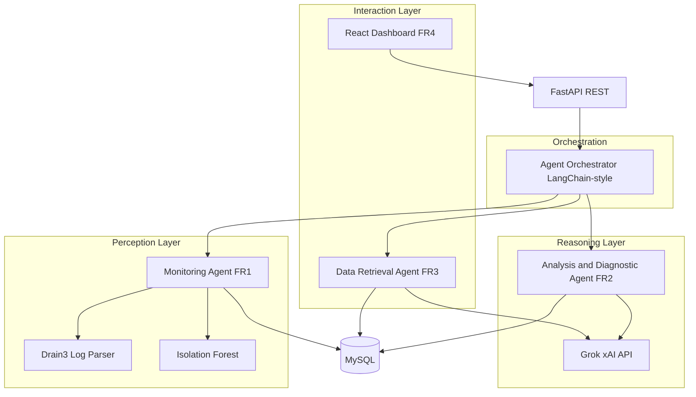

# Fixora — System Architecture

Aligned with CIS013-3 contextual report (Section 4.3–4.4).

## Three-layer model



## Agent responsibilities

| Agent | Layer | Requirements | Techniques |
|-------|-------|--------------|------------|
| Monitoring | Perception | FR1 | Drain3 templates, Isolation Forest, threshold alerts |
| Analysis/Diagnostic | Reasoning | FR2 | Anomaly context + Grok → plain-English root cause |
| Data Retrieval | Interaction | FR3 | Schema-aware NL→SQL, whitelist validation |
| Orchestrator | Coordination | NFR3 | Pipeline: Monitoring → Analysis; standalone NL queries |

## Security (FR5)

- JWT authentication
- Roles: `administrator` (full), `viewer` (read-only)
- SQL sandbox: SELECT-only, table whitelist, no DDL/DML

## Evaluation hooks (Section 4.7)

- `backend/tests/test_anomaly.py` — detection unit tests
- `backend/tests/test_sql_validation.py` — NL query safety
- Baseline: `AnomalyDetectionService.rule_based_baseline()` for comparison with Isolation Forest

## Repository layout

```
Fixora/
├── backend/app/agents/     # Multi-agent implementations
├── backend/app/services/   # LLM, parsing, ML
├── frontend/src/pages/     # Dashboard, Alerts, Logs, Query
├── database/schema.sql     # ER model
└── docs/ARCHITECTURE.md
```
