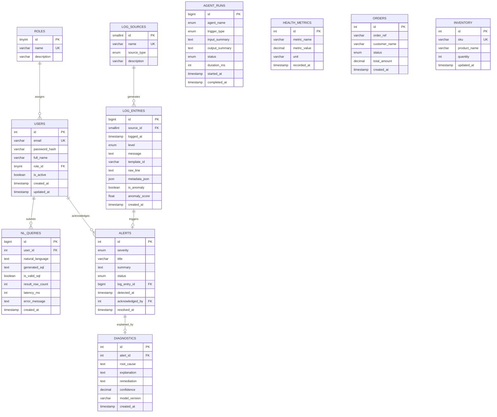
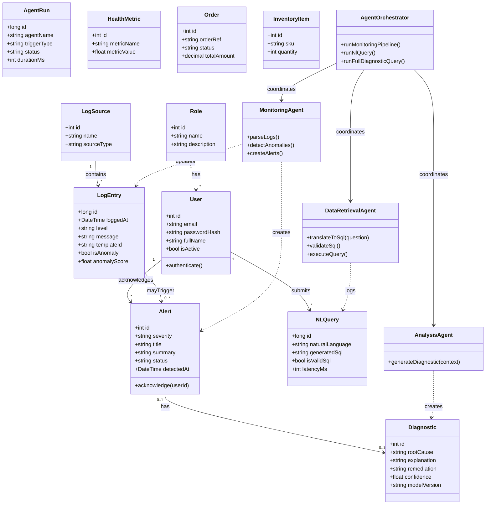
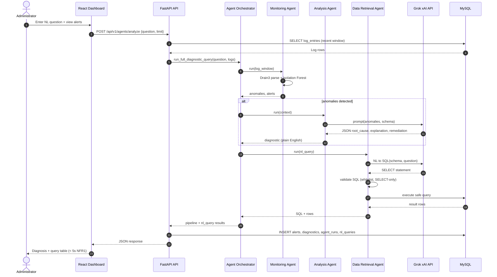
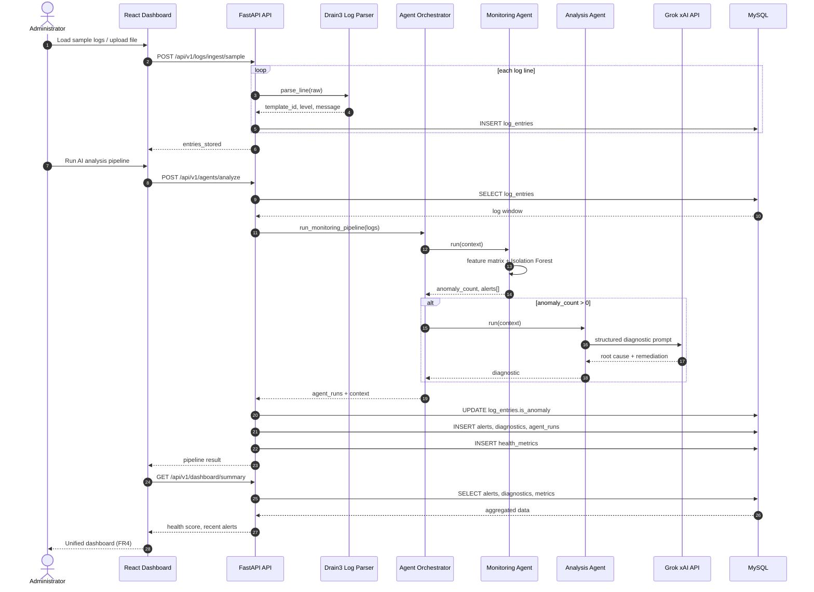
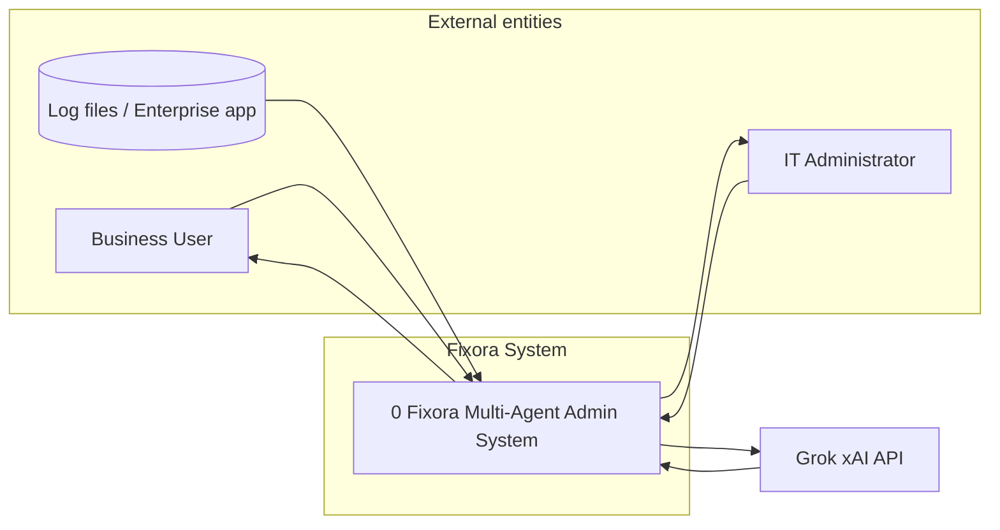
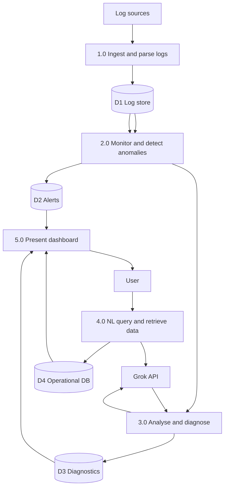

# Fixora — Design Diagrams (Section 4.4)

**Student ID:** 2521838  
**Project:** Multi-Agent AI-Based Automated Administrative System for Enterprise Business Operations  
**Reference:** Contextual Report (CIS013-3), Section 4.4 — Design  

Use these diagrams in your thesis/report. Export via [Mermaid Live](https://mermaid.live), draw.io (Mermaid plugin), or MySQL Workbench (for ER).

---

## Figure A: Entity–Relationship (ER) Diagram

*Covers: user accounts and roles (FR5), log records (FR1), system alerts, agent outputs, operational data, and NL query audit (FR3).*

**Cardinality notes**

| Relationship | Meaning |
|--------------|---------|
| ROLES → USERS | One role; many users (administrator, viewer) |
| LOG_SOURCES → LOG_ENTRIES | One source (app, API, DB); many log lines |
| LOG_ENTRIES → ALERTS | Optional link when Monitoring Agent raises alert |
| ALERTS → DIAGNOSTICS | Analysis Agent may produce one diagnostic per alert |
| USERS → NL_QUERIES | Audit trail for Data Retrieval Agent (FR3) |
| AGENT_RUNS | Standalone audit of each agent execution |

---

## Figure B: Domain Class Diagram (UML)

*Logical object model corresponding to the ER schema and agent outputs.*

---

## Figure C: Sequence Diagram 1 — Natural Language Diagnostic Query (Section 4.3 use case)

*Administrator asks: “What caused the database slowdown in the last hour?” — full agent pipeline (FR1–FR3).*

---

## Figure D: Sequence Diagram 2 — Automated Log Monitoring and Alert Workflow (FR1)

*Log ingestion → anomaly detection → alert → optional diagnostic → dashboard.*

---

## Figure E: DFD Level 0 (Context diagram)

*Required in contextual report Section 4.4 — single process view.*

---

## Figure F: DFD Level 1

---

## How to cite in your report

| Figure | Suggested caption |
|--------|-------------------|
| A | *Entity–Relationship diagram of the Fixora MySQL database schema.* |
| B | *UML domain class diagram showing core entities and multi-agent components.* |
| C | *Sequence diagram: natural language diagnostic query through the multi-agent pipeline (FR1–FR3).* |
| D | *Sequence diagram: automated log monitoring, alerting, and dashboard update (FR1, FR4).* |
| E–F | *Data flow diagrams Level 0 and Level 1 for the Fixora system.* |

**Source:** Researcher's own design based on implemented schema (`database/schema.sql`) and Contextual Report Section 4.3–4.4.

---

## MySQL Workbench

1. **Database → Reverse Engineer** from a running Fixora MySQL instance, or  
2. **File → Import → Reverse Engineer SQL Create Script** → select `database/schema.sql`  
3. Export as PNG/PDF for the thesis (**Figure: ER Diagram**).
