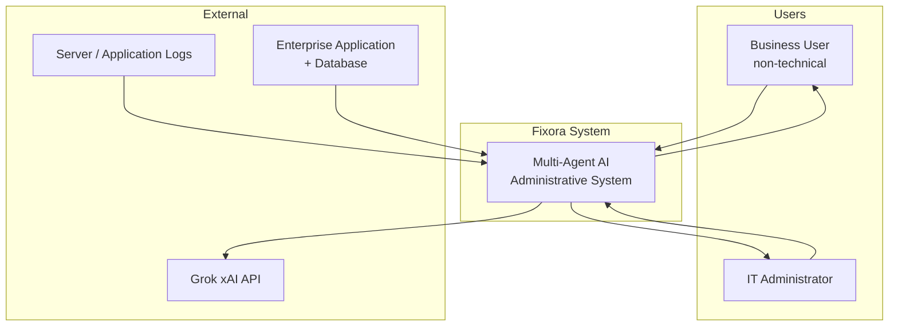
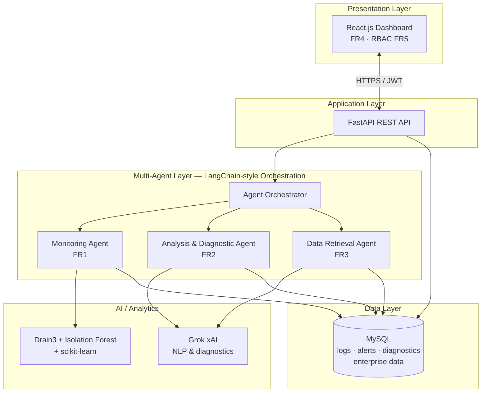
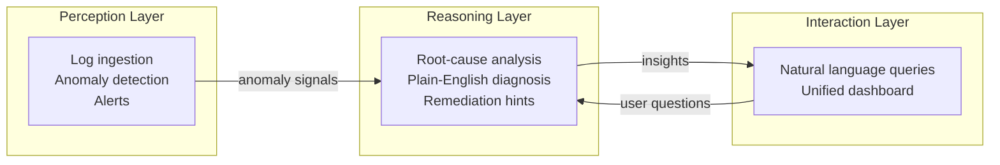
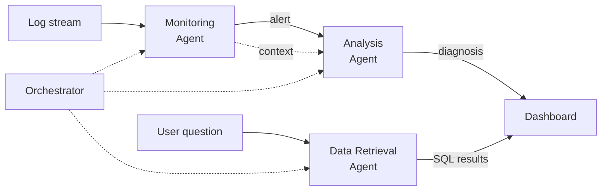
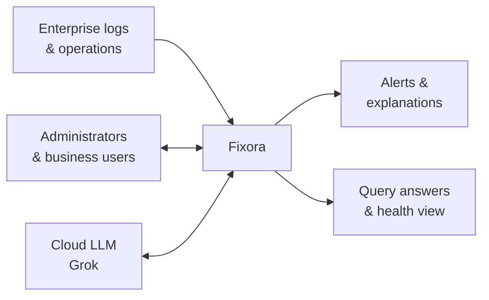
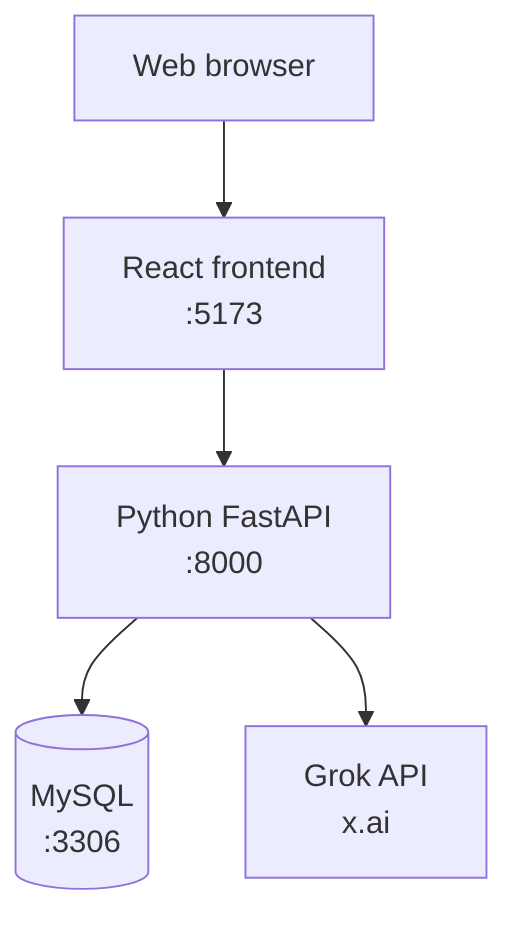

# Fixora — High-Level Diagrams

**Student ID:** 2521838 | **Section 4.4 / Figure 15 style**  
Use [Mermaid Live](https://mermaid.live) to export PNG/SVG for Word or PowerPoint.

---

## Figure 1 — System context (highest level)

*Who interacts with Fixora and what sits outside the system.*

---

## Figure 2 — High-level system architecture

*Main building blocks (matches Contextual Report Figure 15).*

---

## Figure 3 — Three-layer conceptual framework (Section 4.3)

*Perception → Reasoning → Interaction.*

---

## Figure 4 — High-level multi-agent collaboration

*How agents work together (no implementation detail).*

---

## Figure 5 — High-level data flow (DFD Level 0)

---

## Figure 6 — High-level deployment view

---

## Suggested figure captions (for thesis)

| Figure | Caption |
|--------|---------|
| 1 | High-level system context of Fixora showing users, enterprise data sources, and external AI services. |
| 2 | High-level system architecture of the proposed multi-agent AI administrative system. |
| 3 | Three-layer conceptual framework: perception, reasoning, and interaction. |
| 4 | High-level collaboration between Monitoring, Analysis, and Data Retrieval agents. |
| 5 | Context-level data flow diagram (DFD Level 0). |
| 6 | High-level deployment architecture using Docker (frontend, backend, database). |

**Source:** Researcher's own work, Fixora project (2521838), 2026.
